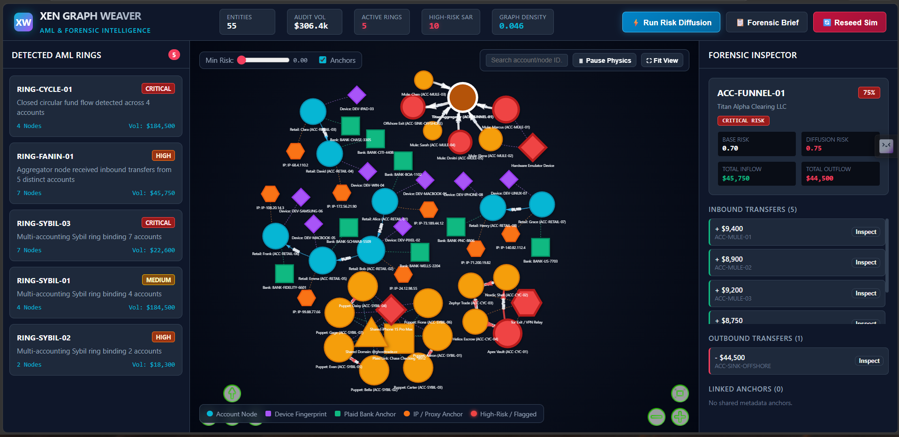
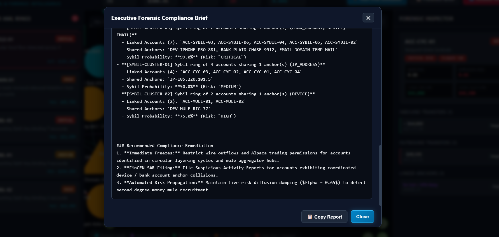

# 🕸️ Xen Graph Weaver
### Anti-Money Laundering (AML) & Sybil Network Intelligence Platform

[](https://www.python.org/)
[](LICENSE)
[]()

**Xen Graph Weaver** is a high-performance graph forensic engine and interactive compliance workstation for transaction monitoring, money laundering ring detection, and multi-accounting Sybil entity resolution.

---

## 📸 Compliance Dashboard Preview

### Interactive Dark-Mode Network & Forensic Inspector


### Automated Forensic AML & Sybil Compliance Brief


---

## 🌟 Key Features

- **Heterogeneous Bipartite Graph Construction**: NetworkX multi-directed graph modeling Account entities alongside shared metadata anchors (Device fingerprints, Plaid bank accounts, IP relays, and Emails).
- **Personalized PageRank & Risk Diffusion**: Multi-step risk propagation engine combining Personalized PageRank (PPR) rooted on watchlist accounts with neighbor contamination diffusion.
- **Topological Laundering Detectors**:
  - 🔄 **Layering Cycles**: Detects closed fund loops ($A \to B \to C \to A$) using `nx.simple_cycles`.
  - 📥 **Mule Fan-In Funnels**: Flags aggregator accounts receiving rapid inflows from multiple satellite depositors.
  - 📤 **Smurfing Fan-Out**: Identifies structuring hubs scattering lump-sum deposits to evade regulatory thresholds.
  - 👥 **Sybil Entity Resolution**: Connected component projection across shared hardware and banking anchors.
- **Interactive Dark-Mode Compliance GUI**: Vis.js canvas with directional animated transfer arrows, real-time node forensic inspector, ring focus zoom, and executive forensic brief generator.
- **Synthetic Simulation Engine**: Built-in mock Alpaca Brokerage API and Plaid transaction feed generator with 3 embedded AML topologies.

---

## 🏗️ Architecture & Directory Structure

```
xen_graph_weaver/
├── assets/                  # UI screenshots & compliance dashboard previews
│   ├── compliance_dashboard.png
│   └── forensic_brief_modal.png
├── models/
│   ├── base.py              # Dataclass serialization base model
│   ├── entity.py            # AccountNode, MetadataNode, TransferEdge, SharedEdge schemas
│   └── summary.py           # GraphSummary, ClusterMetric, RingReport, CentralityTopNode
├── engine/
│   ├── graph_builder.py     # NetworkX heterogeneous graph constructor & Vis.js serializer
│   ├── risk_propagator.py   # Personalized PageRank & Contamination Diffusion algorithms
│   └── graph_summary.py     # Topological summary, centralities & executive compliance narrative
├── detectors/
│   ├── mule_network.py      # Directed cycle detection & Fan-In / Fan-Out mule detectors
│   └── entity_resolver.py   # Connected components on shared Device/Bank/IP anchors
├── simulation/
│   └── alpaca_feed_sim.py   # Mock Alpaca Brokerage & Plaid transaction stream with 3 rings
├── web/
│   ├── server.py            # REST API & static asset server with CORS & forensic endpoints
│   └── static/
│       ├── index.html       # Dark-mode HTML5 Compliance GUI with Vis.js canvas
│       ├── app.js           # Interactive network rendering, node forensics & physics controls
│       └── style.css        # Modern fintech dark theme styling
├── tests/
│   ├── test_detectors.py    # Unit tests for cycle detection & mule identification
│   ├── test_graph_builder.py# Unit tests for heterogeneous graph construction
│   ├── test_summary.py      # Unit tests for risk diffusion & summary generation
│   └── test_web_server.py   # Integration tests for REST API endpoints
├── requirements.txt
└── main.py                  # Server entrypoint (default port 8085)
```

---

## 🚀 Quick Start

### 1. Installation

```bash
git clone https://github.com/gomexeneron/xen_graph_weaver.git
cd xen_graph_weaver
pip install -r requirements.txt
```

### 2. Run the Compliance Server

```bash
python main.py --port 8085
```

Open your browser to:
- **Interactive GUI:** [http://127.0.0.1:8085](http://127.0.0.1:8085)
- **REST Endpoints:** [http://127.0.0.1:8085/api/graph](http://127.0.0.1:8085/api/graph)

---

## 📡 REST API Reference

| Endpoint | Method | Description |
| :--- | :--- | :--- |
| `/api/health` | `GET` | Health status and network element counts |
| `/api/graph` | `GET` | Vis.js network payload (supports `min_risk` and `include_metadata` filters) |
| `/api/summary` | `GET` | Topological summary, centralities, and executive compliance narrative |
| `/api/rings` | `GET` | All detected AML laundering rings and Sybil clusters |
| `/api/sybils` | `GET` | Resolved multi-accounting Sybil entities |
| `/api/node/{node_id}` | `GET` | 1-hop and 2-hop forensic inspection with inflows/outflows |
| `/api/propagate-risk` | `POST` | Executes Personalized PageRank and contamination diffusion |
| `/api/simulate/reset` | `POST` | Re-seeds simulation feed with fresh synthetic fraud patterns |

---

## 🧪 Testing

Run the comprehensive pytest test suite:

```bash
python -m pytest -v
```

---

## 📄 License

MIT License. Designed for fintech compliance, AML research, and graph intelligence workflows.
